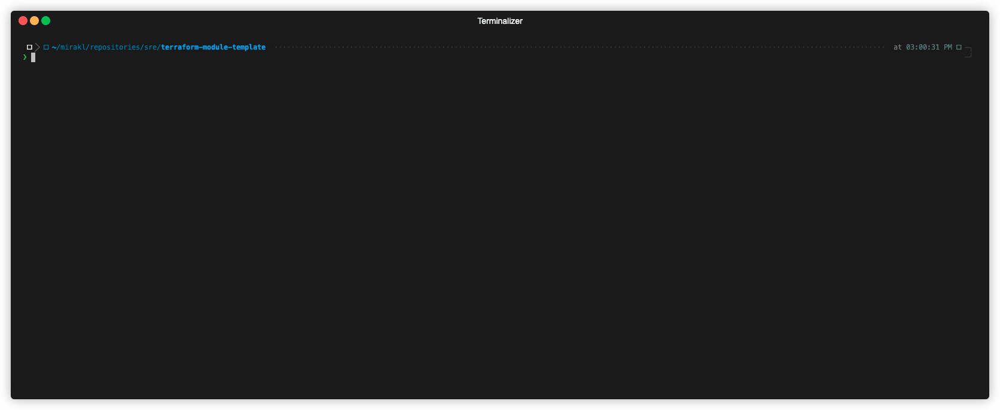

> Lines between **PRE-COMMIT-TERRAFORM DOCS HOOK** markers are generated by `terraform-docs`.

# terraform-module-template

This repository is a template to create a Terraform module repository.

After creating a new module from this template you have to fil the following part of the README:

# [Module name] Terraform module

[short description of your new module]

These types of resources are supported:

* [Resource name] - with a link to the Terraform resource documentation

{If the module includes sub-module that can be used in separated way keep and enrich the following}

Root module calls these modules which can also be used separately to create resources:

* [Sub-module name (with link to the source)] - [short description of the sub-module]

## Features

{Optional section where you should list and explain the different features your module is aim to implement.}

## Usage

{Show a concrete usage (short code example) of your module; ideally, it would be a usage per feature.}

## Examples

{List of the examples you wrote in the folder `examples`}

* [Name of the example] - [short description of the use case of the example]
* minimal - minimal usage of the module (using default values for variables)
* complete - complete usage of the module (setting values for all variables)

## Release / CHANGELOG

Releases are managed using a combination of [git-chglog](https://github.com/git-chglog/git-chglog#installation) (automate generation and update of CHANGELOG.md) and [semtag](https://github.com/nico2sh/semtag#usage) (automate releases) tools.

> `git-chglog` requires at least one tag in order to correctly generate changelog (changes made after that first tag) 

* First configure `git-chglog` this way:
    
    
* Update the repository URL from [changelog configuration file](.chglog/config.yml#L5):

  ~`repository_url: https://github.com/mirakl/terraform-module-template`~

  `repository_url: https://github.com/mirakl/terraform-my-module`

* Then run all steps (checkout a release branch, changelog, commit changelog, push the release branch then tag and push the new version) in once running `make release`

* All you have to do is to create, approve then merge a pull request from the newly created release branch.

* > To have changes groupped by type, you must prefix our commit message with one of `Feature`, `Fix`, `Perf`, ect. More in [config.yml](.chglog/config.yml#L11)

## Tips & Tricks

The `terraform_validate` pre-commit hook do the `terraform init` for you but it may happen that Terraform working directory `.terraform` already exists but not in the best condition (eg, not initialized modules, wrong version of Terraform, etc).

To solve this problem you can find and delete all `.terraform` directories in your repository using this command:

```shell
find . -type d -name ".terraform" -prune -exec rm -rf {} \;exit
```

When `terraform_validate` hook will run, it will try to reinitialize them before running `terraform validate` command.

## Tests

We are using [terratest](https://terratest.gruntwork.io) to test our infrastructure code.

* To configure dependencies, run:
  ```bash
  cd test
  go mod init terraform-module-template/test
  ```
* To run the tests:
  ```bash
  cd test
  go test -v -timeout 20m
  ```
  > We set `-timeout 20m` on all tests not because they necessarily take that long, but because `Go` has a default test timeout of 10 minutes, after which it forcefully kills the tests with a `SIGQUIT`, preventing the cleanup tasks from running. Therefore, we set an overlying long timeout to make sure all tests have enough time to finish and clean up.
* For passing tests, you will have an output similar to below:
  ```bash
  --- PASS: TestTerraformModuleTemplateExamples (3.52s)
  PASS
  ok  	terraform-module-template/test	3.717s
  ```

<!-- BEGINNING OF PRE-COMMIT-TERRAFORM DOCS HOOK -->
## Requirements

| Name | Version |
|------|---------|
| <a name="requirement_terraform"></a> [terraform](#requirement\_terraform) | >= 0.14.4 |
| <a name="requirement_null"></a> [null](#requirement\_null) | >= 3.0.0 |

## Providers

| Name | Version |
|------|---------|
| <a name="provider_null"></a> [null](#provider\_null) | >= 3.0.0 |

## Modules

No modules.

## Resources

| Name | Type |
|------|------|
| [null_resource.hello_word](https://registry.terraform.io/providers/hashicorp/null/latest/docs/resources/resource) | resource |

## Inputs

| Name | Description | Type | Default | Required |
|------|-------------|------|---------|:--------:|
| <a name="input_hello_world"></a> [hello\_world](#input\_hello\_world) | Just prints "Hello World" | `string` | `"echo \"Hello World\""` | no |

## Outputs

| Name | Description |
|------|-------------|
| <a name="output_hello_world"></a> [hello\_world](#output\_hello\_world) | Show the null\_resource id |
<!-- END OF PRE-COMMIT-TERRAFORM DOCS HOOK -->
